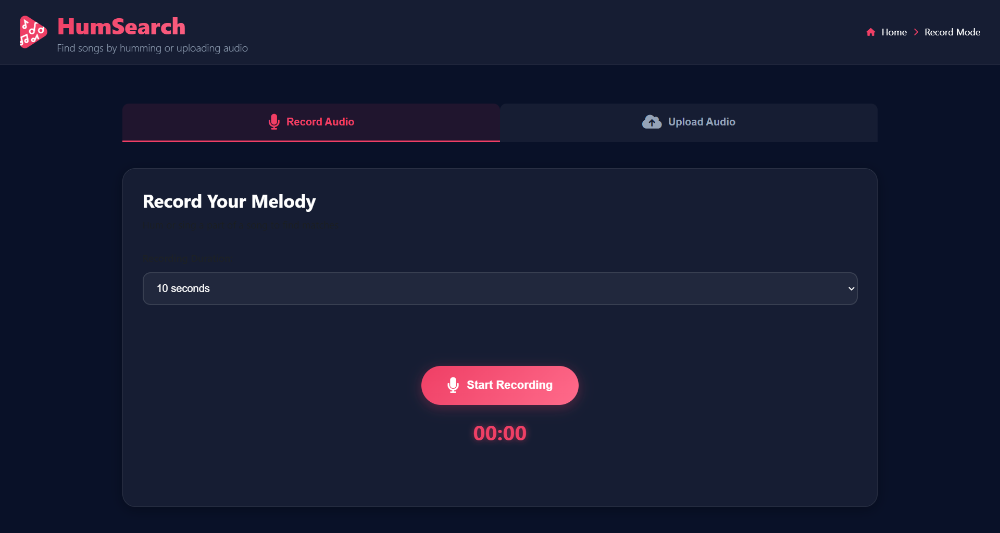

# HumSearch 🎵

<div align="center">


<br/>
<br/>

**Discover songs by humming, singing, or uploading audio!**

<br/>

[](https://www.python.org/)
[](https://www.djangoproject.com/)
[](https://developer.mozilla.org/en-US/docs/Web/JavaScript)
[](https://developer.mozilla.org/en-US/docs/Web/HTML)
[](https://developer.mozilla.org/en-US/docs/Web/CSS)
[](https://ffmpeg.org/)


<br/>

<p align="center" style="display:flex; align-items:flex-start; gap:10px;">
  
  
</p>>

</div>

---

## 📖 About

HumSearch is an innovative web-based music recognition application that identifies songs through humming, singing, or audio file uploads. Built with Django and vanilla JavaScript, it leverages advanced audio feature extraction and matching algorithms to find the best song matches from your personal music library.

Ever had a melody stuck in your head but couldn't remember the song name? HumSearch solves this problem by analyzing the audio characteristics of your humming and matching them against a database of songs.

### Why HumSearch?

- 🎤 **No lyrics needed** - just hum or sing the melody
- 🚀 **Fast and accurate** - get results in seconds with similarity scores
- 🎨 **Beautiful UI** - modern, responsive design with real-time visualizations
- 🔒 **Privacy-focused** - all processing happens on your server
- 📚 **Your music** - works with your own collection of songs

---

## ✨ Features

- 🎤 **Real-time Recording** - Record yourself humming with live audio visualization
- 📁 **File Upload** - Support for MP3, WAV, OGG, M4A, FLAC formats (max 10MB)
- 🔍 **Smart Matching** - Advanced audio feature extraction and similarity matching
- 📊 **Audio Analysis** - View tempo, duration, pitch count, energy, and more
- 🏆 **Ranked Results** - Get top matches with similarity scores and metadata
- ▶️ **Instant Playback** - Listen to matched songs directly in the app
- 🎨 **Theme Support** - Dark/Light theme toggle
- 🌊 **Visual Feedback** - Real-time waveform visualization during recording
- 📱 **Responsive Design** - Works on desktop, tablet, and mobile
- 🔗 **YouTube Integration** - Quick links to find songs on YouTube

---

## 🚀 Getting Started

### Prerequisites

- **Python 3.8+**
- **FFmpeg** (for audio processing)
- **pip** (Python package manager)
- Modern web browser (Chrome, Firefox, or Edge)

### Installation

1. **Clone the repository**
```bash
   git clone https://github.com/yourusername/humsearch.git
   cd humsearch
```

2. **Create a virtual environment** (recommended)
```bash
   python -m venv venv
   
   # On Windows
   venv\Scripts\activate
   
   # On macOS/Linux
   source venv/bin/activate
```

3. **Install FFmpeg**
```bash
   # Ubuntu/Debian
   sudo apt-get update
   sudo apt-get install ffmpeg
   
   # macOS (using Homebrew)
   brew install ffmpeg
   
   # Windows (using Chocolatey)
   choco install ffmpeg
```

4. **Install Python dependencies**
```bash
   pip install django numpy scipy librosa pydub
```

5. **Create necessary directories**
```bash
   mkdir -p media/songs media/uploads
```

6. **Add your music library**
```bash
   # Copy your audio files to the songs directory
   cp /path/to/your/music/*.mp3 media/songs/
```

7. **Run migrations**
```bash
   python manage.py migrate
```

8. **Start the server**
```bash
   python manage.py runserver
```

9. **Open your browser** and navigate to `http://localhost:8000`

---

## 💻 Usage

### 🎤 Recording Mode

1. Click the **Record Mode** tab
2. Select recording duration (5-30 seconds)
3. Click **Start Recording** and hum/sing the melody
4. Watch the real-time audio visualizer
5. Click **Stop Recording** when done
6. Click **Find Matching Songs** to search

### 📁 Upload Mode

1. Click the **Upload Mode** tab
2. Drag and drop an audio file or click to browse
3. Select an audio file from your computer
4. Click **Find Matching Songs** to search

### 📊 Viewing Results

After processing, you'll see:
- **Audio Analysis**: Detailed metrics about your recording (tempo, duration, pitch count, energy)
- **Ranked Matches**: Top songs with similarity scores and metadata
- **Song Actions**: Play preview or search on YouTube

### 💡 Tips for Best Results

- **Hum clearly** - try to match the melody accurately
- **Record 10-15 seconds** - longer recordings provide better matches
- **Choose a distinctive part** - chorus or main hook works best
- **Minimize background noise** - record in a quiet environment
- **Stay consistent** - maintain steady tempo and pitch

---

## 📁 Project Structure
```
.
├── Humming/
│   ├── __init__.py
│   ├── asgi.py
│   ├── settings.py
│   ├── urls.py
│   ├── views.py
│   └── wsgi.py
├── media/
│   ├── songs/
│   └── uploads/
├── static/
│   ├── css/
│   ├── js/
│   │   └── main.js
│   ├── logo-01.png
│   └── logo.png
├── templates/
│   └── index.html
├── utils/
├── .gitignore
├── db.sqlite3
├── init_database.py
├── manage.py
├── requirements.txt
├── sample_songs.py
└── songs_database.json
```

---

## 🔧 How It Works

### Audio Processing Pipeline

1. **Audio Capture/Upload**
   - Records audio using Web Audio API or accepts file uploads
   - Converts to standardized format (WAV, 22050 Hz, mono)

2. **Feature Extraction**
   - **Tempo Detection**: Analyzes beat patterns using onset detection
   - **Pitch Analysis**: Extracts relative pitch contours
   - **Onset Detection**: Identifies note beginnings and rhythmic patterns
   - **Energy Calculation**: Measures overall audio intensity

3. **Matching Algorithm**
   - Compares extracted features against song database
   - Uses weighted similarity scoring:
     - Relative pitch patterns (70%)
     - Tempo matching (20%)
     - Onset patterns (10%)
   - Returns top matches ranked by similarity score

4. **Result Presentation**
   - Displays ranked results with metadata
   - Provides playback and YouTube search options

### Technologies Used

- **Frontend**: Vanilla JavaScript, HTML5, CSS3, Web Audio API
- **Backend**: Django (Python)
- **Audio Processing**: librosa, scipy, numpy
- **Audio Conversion**: FFmpeg, pydub

---
---

## 👥 Team

- **Alhussien Ayman**   
- **Mohamed Elsayyed Attallah**
- **Abdullah Khalefa**  
- **Ahmed Elshinawy**  
> Built with ❤️ as a collaborative project


